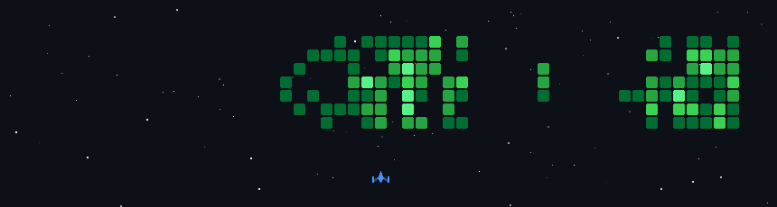

# Hello, I'm Riko

📍 Shanghai · 💻 Open to remote opportunities

## About me

- 🔭 Built some interesting software
- 🌱 Open-source project with 10K+ users and downloads from 118 countries
- 🧑‍💼 9 years building technology for the entertainment ticketing and travel industries
- 🤖 Specialized in Android and working with AI extensively in my daily work
- 🚀 Exploring AI since the GitHub Copilot Technical Preview
- 🌍 Traveled to 60+ cities and always curious about the world

## Keywords

    

## 

 

## Open a connection

  
